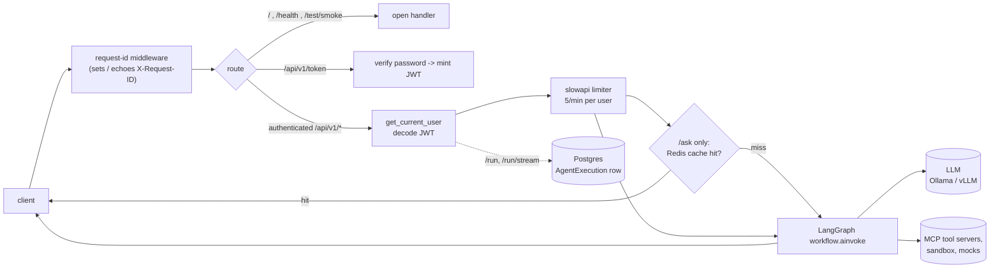

# Agentic Enterprise Platform

An enterprise-grade platform for agents, built with LangChain/LangGraph and
FastAPI, running against an OpenAI-compatible LLM backend (Ollama locally,
vLLM in production). It exposes conversational agent routes with cross-thread
semantic memory, real tool access behind auth boundaries (a jailed
filesystem, sandboxed code execution, external finance/risk APIs), and an
autonomous multi-step research loop, all backed by durable, replayable
LangGraph checkpoints.

## Requirements

- Python 3.13+
- [`uv`](https://docs.astral.sh/uv/) for dependency management
- Podman (or Docker) with `compose` for containerized runs
- An OpenAI-compatible LLM backend reachable from the app — Ollama for
  local development, vLLM for production

## Running locally

```bash
uv sync
uv run uvicorn app.main:app --reload
```

The API is served at `http://localhost:8000`. Postgres, Redis, and Qdrant are
needed for the `/api/v1/*` routes — run them with
`podman compose up -d db redis qdrant`, or bring the whole stack up in a
container (below). The three local MCP servers (filesystem, risk, finance —
see [MCP tool servers](#mcp-tool-servers)) also need to be running before any
route that binds tools reaches them.

## Architecture

Two compiled LangGraph workflows share one FastAPI app:

- **The main graph** (`app/graph/engine.py`) — a router dispatches each
  request to a `technical` / `billing` / `general` / `investment` worker.
  Every route passes through a semantic-memory retrieval node first. The
  `technical` and `investment` paths can call tools; `general` drafts are
  graded by a critic node and revised until they pass or hit a revision cap.
- **The research graph** (`app/graph/research.py`) — a standalone cyclic
  `agent -> tools -> agent -> ...` loop for open-ended, multi-step research
  questions. The model itself decides when it has read enough; a
  `recursion_limit` is the actual backstop against that being unbounded, not
  a formality.

Both graphs use the same `RuntimeContext` (LLM handles, DB session,
username) and the same tool list (`app/graph/tools.py`), and both persist
state in Postgres via LangGraph checkpoints, so any thread is resumable,
forkable, and replayable after a restart.



Exceptions are normalised to a JSON error shape by handlers in `app/main.py`
(`AgenticException`, `RequestValidationError`, `RateLimitExceeded`,
`GraphRecursionError`).

## API

`GET /`, `GET /health`, `GET /graph`, `GET /graph.png`, and `POST /test/smoke`
are open. Everything under `/api/v1` except `/token` requires a bearer token;
every `/api/v1/admin/threads/{thread_id}/*` route additionally requires the
caller to own that thread (or be the admin account) — the first caller to
touch a `thread_id` claims it.

| Route                                                | Method | Auth               | Notes                                                                    |
| ----------------------------------------------------- | ------ | ------------------- | ------------------------------------------------------------------------ |
| `/`                                                   | GET    | no                  | Liveness                                                                  |
| `/health`                                             | GET    | no                  | System health status                                                     |
| `/graph`                                              | GET    | no                  | The main graph as Mermaid text                                          |
| `/graph.png`                                          | GET    | no                  | The main graph rendered as a PNG (via mermaid.ink)                       |
| `/test/smoke`                                         | POST   | no                  | End-to-end main-graph run, returns latency and the LLM reply             |
| `/api/v1/token`                                       | POST   | no                  | OAuth2 password flow, returns a JWT                                      |
| `/api/v1/run`                                         | POST   | yes                 | Run the main graph, writes an `AgentExecution` row, 5/min per user       |
| `/api/v1/run/stream`                                  | POST   | yes                 | Same, streamed as SSE, 5/min per user                                    |
| `/api/v1/ask`                                         | GET    | yes                 | Read-shaped query, response cached in Redis 5 min, 5/min per user        |
| `/api/v1/analyze`                                     | POST   | yes                 | Ticker analysis, forced tool call then a schema-locked report            |
| `/api/v1/research`                                    | POST   | yes                 | Autonomous research loop over a topic; returns a schema-locked report    |
| `/api/v1/conversations/{conversation_id}`             | GET    | yes                 | Replay a thread's messages from its checkpoint, no graph run             |
| `/api/v1/admin/threads/{thread_id}/history`           | GET    | owner/admin         | Every checkpoint for a thread, newest first                              |
| `/api/v1/admin/threads/{thread_id}/resume`            | POST   | owner/admin         | Finish an interrupted run from its last checkpoint                       |
| `/api/v1/admin/threads/{thread_id}/fork`              | POST   | owner/admin         | Branch a thread from a past checkpoint with a new message                |
| `/api/v1/admin/threads/{thread_id}/edit`              | POST   | owner/admin         | Overwrite `critique`/`revision_count` at a past checkpoint               |
| `/api/v1/admin/threads/{thread_id}/branches`          | GET    | owner/admin         | Checkpoints grouped by parent — where a thread forked or was edited      |
| `/api/v1/admin/threads/{thread_id}/memory/remember`   | POST   | owner/admin         | Embed a fact into semantic memory, tagged with this thread               |
| `/api/v1/admin/memory/search`                         | GET    | yes                 | Cosine-similarity search across the caller's own remembered facts        |
| `/api/v1/admin/gc`                                    | POST   | yes                 | Trigger a checkpoint retention sweep now                                 |
| `/api/v1/admin/gc/stats`                              | GET    | yes                 | Row counts per checkpoint table, oldest live thread                      |

Every response carries an `X-Request-ID` header (echoed if the client sends
one); it also tags every log line for that request.

### Smoke test

```bash
curl -X POST http://localhost:8000/test/smoke \
  -H "Content-Type: application/json" \
  -d '{"test_id": "ST-2026-001", "payload": "System Check: Respond with '\''READY'\''"}'
```

### Authenticated call

```bash
# 1. get a token (DEMO_PASSWORD must be set — see Configuration)
TOKEN=$(curl -s -X POST http://localhost:8000/api/v1/token \
  -d 'username=admin&password=YOUR_DEMO_PASSWORD' | python3 -c 'import sys,json;print(json.load(sys.stdin)["access_token"])')

# 2. use it
curl -X POST http://localhost:8000/api/v1/run \
  -H "Authorization: Bearer $TOKEN" -H "Content-Type: application/json" \
  -d '{"agent_id": "demo", "task_description": "Summarise the last deployment."}'
```

### Research call

```bash
curl -X POST http://localhost:8000/api/v1/research \
  -H "Authorization: Bearer $TOKEN" -H "Content-Type: application/json" \
  -d '{"topic": "Summarize the Q3 financial projections file", "thread_id": "research-001"}'
```

Returns a `ResearchReport`: `topic`, `summary`, `sources_consulted` (files
the model claims to have read), and a self-assessed `confidence` (0.0–1.0).
`sources_consulted` is the model's own account of what it read — cross-check
it against `file_audit_events` (below) rather than trusting it outright.

## Tool access

Agents reach real tools through `app/graph/tools.py`'s `load_tools()`, which
combines:

- **MCP servers** (own processes, streamable HTTP, bearer-token
  authenticated) — see [MCP tool servers](#mcp-tool-servers).
- **Sandboxed code execution** (`app/tools/code_executor.py`) — agent-written
  Python runs in a gVisor-isolated, network-disabled container with a
  10-second timeout, 128MB memory cap, and 32-process cap. Every run writes a
  `CodeExecutionEvent` row (`outcome`, code length, stdout/stderr tail).
  gVisor needs a real Linux kernel, so on macOS this reaches a remote Podman
  socket (`SANDBOX_PODMAN_URL`) on a Linux host configured with `runsc` as
  its default OCI runtime, rather than running locally.
- **Mock tools** — `get_deployment_status`, `get_weather`,
  `get_market_metrics` — stand in for services this project doesn't operate.

### MCP tool servers

Three local [Model Context Protocol](https://modelcontextprotocol.io/)
servers, each its own process, each behind the shared `MCP_AUTH_TOKEN`
bearer token (`app/mcp/auth.py`):

| Module                   | Port | Tools                                              |
| ------------------------- | ---- | --------------------------------------------------- |
| `app.mcp.fs_server`        | 8101 | `read_text_file`, `write_text_file`, `list_directory` — jailed to `AGENT_FILES_DIR`, every read and write logged to `file_audit_events` |
| `app.mcp.risk_server`      | 8100 | `calculate_corporate_risk`                          |
| `app.mcp.finance_server`   | 8103 | `get_account_balance` — OAuth2 client-credentials against a separate finance API, every call logged to `balance_query_events` |

Start each with `uv run python -m <module>` (see the table above). `app/graph/tools.py`
fails loudly if any of the three is unreachable when the app's tool list is
built — that's a fail-fast, not a bug to route around.

## Running in a container

```bash
# local development, hot reload
podman compose -f compose.yaml -f compose.mac.yaml up -d

# production
podman compose -f compose.yaml -f compose.prod.yaml up -d
```

The stack is `agent-api`, `redis`, `db` (Postgres), and `qdrant`. The `db`
service publishes on host port **5433**, not 5432, so it coexists with a
native Postgres a dev may already be running; other services follow the same
non-default-host-port convention where a default would collide. Inside the
compose network, services address each other by their default ports (e.g.
`db:5432`). After an env change, use `up -d` (recreates the container) —
`podman compose restart` keeps the old environment. The MCP servers are not
part of this compose stack; run them as local processes.

## Configuration

Config is read from `.env.mac` / `.env.production` (see `.env.mac.example` /
`.env.production.example`). Keys:

| Key                                       | Purpose                                                    |
| ------------------------------------------ | ---------------------------------------------------------- |
| `LLM_PROVIDER`                             | `ollama` \| `vllm`                                         |
| `LLM_BASE_URL`, `LLM_MODEL`                | backend URL and model name                                 |
| `DATABASE_URL`                             | async Postgres DSN (`postgresql+asyncpg://…`)              |
| `CHECKPOINT_DB_URL`                        | sync Postgres DSN for the LangGraph checkpointer            |
| `CHECKPOINT_RETENTION_DAYS`                | delete a thread this many days after its newest checkpoint  |
| `CHECKPOINT_GC_INTERVAL_HOURS`             | background sweep interval; `0` disables it                  |
| `REDIS_URL`                                | response-cache backend; app serves uncached if unreachable  |
| `JWT_SECRET`                               | HS256 signing key — `openssl rand -hex 32`                  |
| `DEMO_USERNAME`, `DEMO_PASSWORD`           | demo login; leave `DEMO_PASSWORD` blank to seed no users     |
| `DEMO2_USERNAME`, `DEMO2_PASSWORD`         | second demo login, for testing thread-ownership boundaries   |
| `EMBEDDING_BASE_URL`, `EMBEDDING_MODEL`    | embedding backend for semantic memory                        |
| `QDRANT_URL`, `QDRANT_COLLECTION`          | vector store for cross-thread semantic memory                |
| `MCP_AUTH_TOKEN`                           | shared bearer token for the local MCP servers                |
| `AGENT_FILES_DIR`, `AGENT_FILES_MAX_WRITE_BYTES` | filesystem-MCP jail root and per-write size cap        |
| `SANDBOX_PODMAN_URL`                       | remote Podman socket for sandboxed code execution             |
| `FINANCE_API_URL`, `FINANCE_OAUTH_*`       | OAuth2 client-credentials config for the finance MCP server    |

## Tests

```bash
uv run pytest                        # full suite, including live LLM calls
uv run pytest -m "not integration"   # fast, no external dependencies
```

The suite shares fixtures from `tests/conftest.py` — an isolated app with a
stubbed graph, a fake DB session, an in-memory cache, and a `client` /
`auth_headers` pair — so most tests need no external dependency. Tests
tagged as needing the MCP servers or a live LLM skip automatically when
those aren't reachable.

## Load test

`locustfile.py` at the repo root defines a load profile (login, then a mix of
`/ask`, `/run`, and `/health`). With the stack up:

```bash
uv run locust -f locustfile.py --host http://localhost:8000   # web UI on :8089
```

Results and how to read them are in
[`docs/load-test-module-2.md`](docs/load-test-module-2.md).

## Project layout

```text
app/
  main.py              FastAPI app, lifespan, middleware, exception handlers
  core/                settings, LLM client, request-id context, JWT, exceptions
  graph/
    engine.py           main dispatch graph (router -> technical/billing/general/investment)
    research.py          standalone autonomous research graph (agent -> tools -> agent -> report)
    tools.py             the shared tool list: MCP tools, sandbox, mocks
    history.py           checkpoint timeline, branch tree, resume/fork/edit helpers
    ownership.py         thread ownership claim/check
    gc.py                checkpoint retention sweep
  mcp/                  local MCP servers (filesystem, risk, finance) and their auth
  tools/code_executor.py sandboxed Python execution over a remote gVisor-backed Podman
  memory/vector_store.py Qdrant-backed cross-thread semantic memory
  schemas/              Pydantic request/response and error models
  api/v1/                versioned routers: health, auth, endpoints
  database.py            async engine, session dependency, TimestampMixin
  models.py              SQLAlchemy models (audit and execution tables)
docs/                    architecture and pattern notes
tests/                   pytest suite + shared fixtures
locustfile.py            load-test profile
```

See [`docs/graph-core.md`](docs/graph-core.md) for how both graphs are
wired, and [`docs/ollama-to-vllm-pattern.md`](docs/ollama-to-vllm-pattern.md)
for the local-to-production LLM backend pattern.

## Dev container

This repo includes a [devcontainer](.devcontainer/devcontainer.json)
(Python 3.13, `curl`, `git`, `openssh-client`, with the Python, Pylance,
autoDocstring, and Even Better TOML VS Code extensions).

Open this folder in VS Code and select **Reopen in Container** (requires
the [Dev Containers extension](https://marketplace.visualstudio.com/items?itemName=ms-vscode-remote.remote-containers)).
