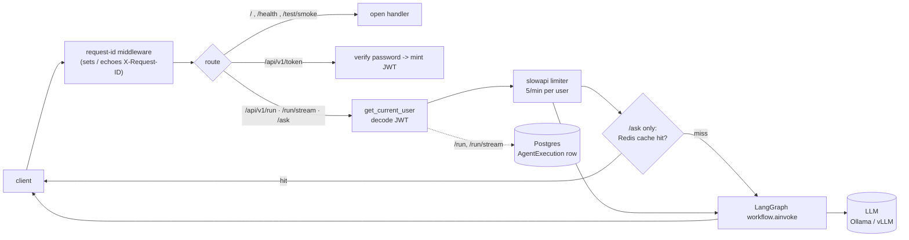

# Agentic Enterprise Labs

An enterprise-grade platform for agents, built with LangChain/LangGraph and
FastAPI, running against an OpenAI-compatible LLM backend (Ollama locally,
vLLM in production).

## Requirements

- Python 3.13+
- [`uv`](https://docs.astral.sh/uv/) for dependency management
- Podman (or Docker) with `compose` for containerized runs
- An OpenAI-compatible LLM backend reachable from the app — Ollama for
  local development, vLLM for production

## Running locally

```bash
uv sync
uv run uvicorn app.main:app --reload
```

The API is served at `http://localhost:8000`. Postgres and Redis are needed
for the `/api/v1/*` routes — run them with `podman compose up -d db redis`, or
bring the whole stack up in a container (below).

## Request path



Exceptions are normalised to a JSON error shape by handlers in `app/main.py`
(`AgenticException`, `RequestValidationError`, `RateLimitExceeded`,
`GraphRecursionError`).

## API

`GET /` and `GET /health` are open. `POST /test/smoke` runs the LangGraph
workflow end to end and is open. Everything under `/api/v1` except `/token`
requires a bearer token.

| Route                | Method | Auth | Notes                                                             |
| -------------------- | ------ | ---- | ----------------------------------------------------------------- |
| `/`                  | GET    | no   | Liveness                                                          |
| `/health`            | GET    | no   | System health status                                              |
| `/test/smoke`        | POST   | no   | End-to-end workflow run, returns latency and the LLM reply        |
| `/api/v1/token`      | POST   | no   | OAuth2 password flow, returns a JWT                               |
| `/api/v1/run`        | POST   | yes  | Run the agent, writes an `AgentExecution` row, 5/min per user     |
| `/api/v1/run/stream` | POST   | yes  | Same, streamed as SSE, 5/min per user                             |
| `/api/v1/ask`        | GET    | yes  | Read-shaped query, response cached in Redis 5 min, 5/min per user |

Every response carries an `X-Request-ID` header (echoed if the client sends
one); it also tags every log line for that request.

### Smoke test

```bash
curl -X POST http://localhost:8000/test/smoke \
  -H "Content-Type: application/json" \
  -d '{"test_id": "ST-2026-001", "payload": "System Check: Respond with '\''READY'\''"}'
```

### Authenticated call

```bash
# 1. get a token (DEMO_PASSWORD must be set — see Configuration)
TOKEN=$(curl -s -X POST http://localhost:8000/api/v1/token \
  -d 'username=admin&password=YOUR_DEMO_PASSWORD' | python3 -c 'import sys,json;print(json.load(sys.stdin)["access_token"])')

# 2. use it
curl -X POST http://localhost:8000/api/v1/run \
  -H "Authorization: Bearer $TOKEN" -H "Content-Type: application/json" \
  -d '{"agent_id": "demo", "task_description": "Summarise the last deployment."}'
```

## Running in a container

```bash
# local development, hot reload
podman compose -f compose.yaml -f compose.mac.yaml up -d

# production
podman compose -f compose.yaml -f compose.prod.yaml up -d
```

The stack is three services: `agent-api`, `redis`, and `db` (Postgres). The
`db` service publishes on host port **5433**, not 5432, so it coexists with a
native Postgres. After an env change, use `up -d` (recreates the container) —
`podman compose restart` keeps the old environment.

## Configuration

Config is read from `.env.mac` / `.env.production` (see `.env.mac.example` /
`.env.production.example`). Keys:

| Key                              | Purpose                                                    |
| -------------------------------- | ---------------------------------------------------------- |
| `LLM_PROVIDER`                   | `ollama` \| `vllm`                                         |
| `LLM_BASE_URL`, `LLM_MODEL`      | backend URL and model name                                 |
| `DATABASE_URL`                   | async Postgres DSN (`postgresql+asyncpg://…`)              |
| `REDIS_URL`                      | response-cache backend; app serves uncached if unreachable |
| `JWT_SECRET`                     | HS256 signing key — `openssl rand -hex 32`                 |
| `DEMO_USERNAME`, `DEMO_PASSWORD` | demo login; leave `DEMO_PASSWORD` blank to seed no users   |

## Tests

```bash
uv run pytest                        # full suite, including live LLM calls
uv run pytest -m "not integration"   # fast, no external dependencies
```

The suite shares fixtures from `tests/conftest.py` — an isolated app with a
stubbed graph, a fake DB session, an in-memory cache, and a `client` /
`auth_headers` pair — so no test needs Postgres, Redis, or the LLM.

## Load test

`locustfile.py` at the repo root defines a load profile (login, then a mix of
`/ask`, `/run`, and `/health`). With the stack up:

```bash
uv run locust -f locustfile.py --host http://localhost:8000   # web UI on :8089
```

Results and how to read them are in
[`docs/load-test-module-2.md`](docs/load-test-module-2.md).

## Project layout

```text
app/
  main.py              FastAPI app, middleware, exception handlers, /test/smoke
  core/                settings, LLM client, request-id context, JWT, exceptions
  graph/engine.py      LangGraph workflow (one node, calls the LLM)
  schemas/             Pydantic request/response and error models
  api/v1/              versioned routers: health, auth, endpoints (run/ask/stream)
  database.py          async engine, session dependency, TimestampMixin
  models.py            SQLAlchemy models (AgentExecution)
docs/                  architecture and pattern notes
tests/                 pytest suite + shared fixtures
locustfile.py          load-test profile
```

See [`docs/graph-core.md`](docs/graph-core.md) for how the LangGraph
workflow is wired, and
[`docs/ollama-to-vllm-pattern.md`](docs/ollama-to-vllm-pattern.md) for the
local-to-production LLM backend pattern.

## Dev container

This repo includes a [devcontainer](.devcontainer/devcontainer.json)
(Python 3.13, `curl`, `git`, `openssh-client`, with the Python, Pylance,
autoDocstring, and Even Better TOML VS Code extensions).

Open this folder in VS Code and select **Reopen in Container** (requires
the [Dev Containers extension](https://marketplace.visualstudio.com/items?itemName=ms-vscode-remote.remote-containers)).
