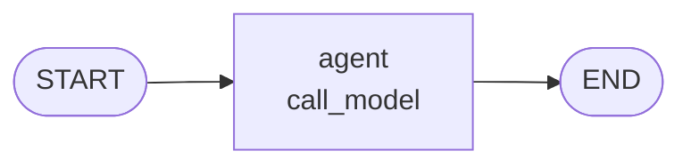
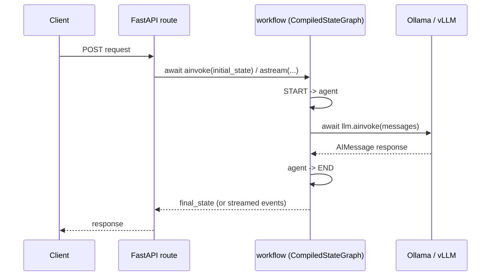

# How `app/graph/engine.py` Works

## State schema

`AgentState` is the shared data structure passed through every node in the
graph. Every node reads it and returns a partial update to it.

```python
class AgentState(TypedDict):
    messages: Annotated[list[BaseMessage], "The conversation history"]
    status: str
```

## The graph

One node, no branching, no loops:



- `add_edge(START, "agent")` — execution begins at the `agent` node.
- `add_node("agent", call_model)` — registers `call_model` under the name `"agent"`.
- `add_edge("agent", END)` — after `agent` runs, the graph terminates.

## What `call_model` does

```python
async def call_model(state: AgentState) -> dict:
    writer = get_stream_writer()
    writer({"status": "invoking model"})
    response = await llm.ainvoke(state["messages"])
    writer({"status": "model responded"})
    return {
        "messages": state["messages"] + [response],
        "status": "completed",
    }
```

1. Passes the whole message history to the LLM (Ollama/vLLM via
   `get_sovereign_llm()`) — the real network call, `await`ed so the event loop
   stays free.
2. Emits `{"status": ...}` custom events through `get_stream_writer()` — these
   are what `POST /api/v1/run/stream` forwards to the client as SSE. Outside a
   streaming context the writes are no-ops.
3. Returns an update: `messages` with the LLM's `AIMessage` appended,
   `status` set to `"completed"`.

LangGraph merges a node's returned dict into existing state per key. There's
no reducer declared on `messages` here, so `call_model` manually appends
(`state["messages"] + [response]`) rather than relying on automatic
accumulation.

## Compiling

```python
workflow = graph_builder.compile()
```

`compile()` turns the builder into a `CompiledStateGraph` — the runnable
object with `.invoke()` / `.ainvoke()`. This graph is compiled **without a
checkpointer**, so it has no persistence: each call starts fresh with
whatever `initial_state` it's given.

## Who calls it



| Caller                                            | Method                                                        | Notes                                                |
| ------------------------------------------------- | ------------------------------------------------------------- | ---------------------------------------------------- |
| `app/main.py` — `/test/smoke`                     | `await workflow.ainvoke(state)` wrapped in `asyncio.wait_for` | open route, 60 s timeout                             |
| `app/api/v1/endpoints.py` — `/api/v1/run`, `/ask` | `await workflow.ainvoke(state)`                               | authenticated, rate-limited; `/ask` result is cached |
| `app/api/v1/endpoints.py` — `/api/v1/run/stream`  | `async for … in workflow.astream(state, stream_mode=...)`     | streams `call_model`'s writer events as SSE          |

## Standalone script

The `if __name__ == "__main__":` block runs the graph directly, outside of
any FastAPI route — useful for a quick manual check:

```python
final_state = workflow.invoke(initial_input)
print(f"Response: {final_state['messages'][-1]}")
```

Note this prints the raw `AIMessage` object's `repr`, not just its text,
since `call_model` appends the full message object rather than
`response.content`.
