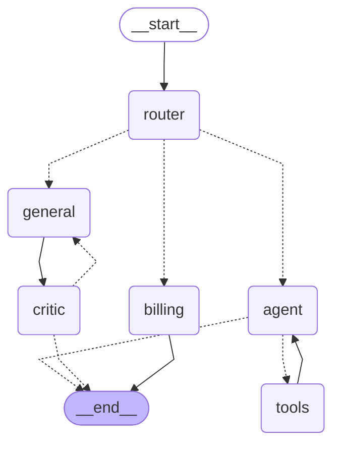

# How `app/graph/engine.py` Works

## State schemas

The graph has three `TypedDict` schemas:

- **`GraphInput`** — what a caller may pass in. Just `messages`.
- **`GraphState`** — the full shared scratchpad every node reads and writes.
- **`GraphOutput`** — what the compiled graph returns: `messages` and `status`.
  The scratchpad keys (`internal_logs`, `route_to`, `revision_count`,
  `critique`) never leave the graph.

```python
class GraphState(TypedDict):
    messages: Annotated[list[BaseMessage], add_messages]
    status: str
    internal_logs: Annotated[list[str], merge_logs]
    route_to: Literal["technical", "billing", "general"]
    revision_count: int  # no reducer -> overwrite
    critique: str        # no reducer -> overwrite
```

Reducers control how a node's returned value merges into state per key:

- `messages` uses `add_messages` — append, de-duplicating by message id (Lab 21).
- `internal_logs` uses `merge_logs` — a custom append-only reducer that tolerates
  a `None` left side and skips lines already present, so the `general <-> critic`
  cycle cannot duplicate audit entries.
- Keys with no `Annotated` reducer overwrite.

Every node returns only its own delta (`{"messages": [response]}`,
`{"internal_logs": ["router: ..."]}`); LangGraph merges via the reducer.

## The graph

Regenerate this block from the compiled graph:

```bash
uv run python -c "from app.graph.engine import workflow; print(workflow.get_graph().draw_mermaid())"
```



Solid arrows are unconditional edges; dotted arrows (`-.->`) are conditional
edges resolved at runtime by a router function.

## Nodes

| Node | Function | Role |
| --- | --- | --- |
| `router` | `route_request` | Classifies the last human message as `technical` / `billing` / `general`, writes `route_to`. |
| `agent` | `call_model` | Calls the LLM (Ollama/vLLM via `get_sovereign_llm()`, bound to `tools`). Loops with `tools` until the model stops requesting tool calls. |
| `tools` | `ToolNode(tools)` | Executes the tool calls the model asked for, returns results to `agent`. |
| `billing` | `billing_worker` | Terminal stub reply for billing requests. |
| `general` | `general_worker` | Drafts a general-enquiries answer. Re-entered by the critic loop; increments `revision_count`. |
| `critic` | `critic` | Grades the latest `general` draft, writes `critique` (`"PASS"` or a note). |

## Edges

- `START -> router` — every request is classified first.
- `router` (conditional, `pick_route`) — `technical -> agent`, `billing ->
  billing`, `general -> general`.
- `agent` (conditional, `tools_condition`) — tool calls pending `-> tools`,
  otherwise `-> END`.
- `tools -> agent` — unconditional; the tool loop.
- `billing -> END`.
- `general -> critic` — unconditional; every draft is graded.
- `critic` (conditional, `after_critic`) — `critique == "PASS"` `-> END`,
  otherwise `-> general`. `GENERAL_REVISION_LIMIT` (3) forces `PASS` to break
  the cycle.

## Compiling

```python
graph_builder = StateGraph(
    GraphState, input_schema=GraphInput, output_schema=GraphOutput
)
# add_node / add_edge / add_conditional_edges ...
workflow = graph_builder.compile()
```

`compile()` returns a `CompiledStateGraph` with `.ainvoke()` / `.astream()`.
Compiled **without a checkpointer** — no persistence; each call starts fresh
from its `initial_state`.

`input_schema` filters the inbound dict to `GraphInput` keys; `output_schema`
prunes the return value to `GraphOutput`. On langgraph 1.x, override the pruning
at call time with `output_keys=[...]`, not the `output_schema=` kwarg (which no
longer exists on `ainvoke` / `astream`).

## Who calls it

| Caller | Method | Notes |
| --- | --- | --- |
| `app/main.py` — `/test/smoke` | `await workflow.ainvoke(state)` wrapped in `asyncio.wait_for` | open route, 60 s timeout |
| `app/api/v1/endpoints.py` — `/api/v1/run`, `/ask` | `await workflow.ainvoke(state)` | authenticated, rate-limited; `/ask` result is cached |
| `app/api/v1/endpoints.py` — `/api/v1/run/stream` | `async for … in workflow.astream(state, stream_mode=["updates", "custom"])` | streams node deltas and `writer({"status": ...})` events as SSE |

All callers build the initial state as `{"messages": [HumanMessage(...)]}` (or
`{"messages": [("user", ...)]}` in the smoke test) and read the result as
`result["messages"][-1].content`.

## Standalone script

The `if __name__ == "__main__":` block runs the three canonical prompts
(technical / billing / general) directly, outside any FastAPI route:

```bash
uv run python -m app.graph.engine
```

It streams `stream_mode="values"` with `output_keys=list(GraphState.__annotations__)`
so the full scratchpad is visible while developing, and pretty-prints the last
message at each step.
