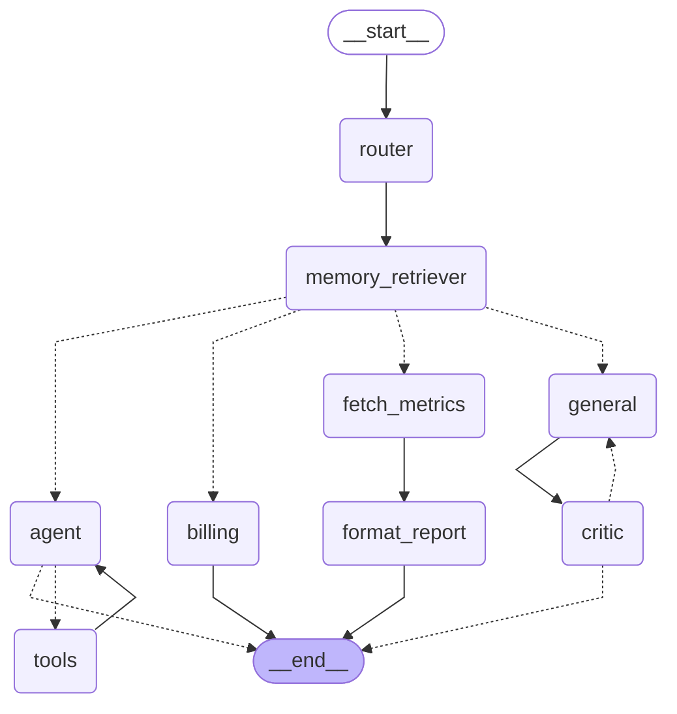
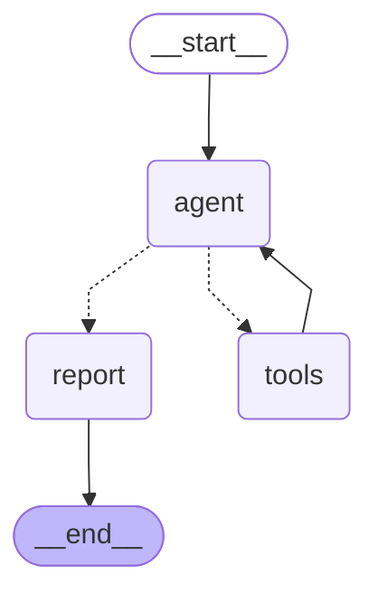

# How the graphs work

There are two compiled LangGraph workflows in this codebase, each with its
own module and its own state shape:

- **The main graph** (`app/graph/engine.py`) — a router dispatches every
  request to one of four workers (`technical`, `billing`, `general`,
  `investment`), all reached through one shared semantic-memory retrieval
  node.
- **The research graph** (`app/graph/research.py`) — a standalone,
  open-ended `agent -> tools -> agent -> ...` loop for autonomous, multi-step
  research over real files and tools.

They're separate `StateGraph`s on purpose: the main graph is a fixed
dispatch shape (classify, retrieve, run exactly one worker), while the
research graph is a genuinely different control-flow shape (a cycle whose
length the model decides at runtime). Folding the second into the first's
`Literal` routing would make both harder to reason about. Both share the
same `RuntimeContext` dataclass and the same tool list
(`app/graph/tools.py`'s `load_tools()`), and both persist state through
LangGraph checkpoints in Postgres, so any thread from either graph is
resumable and replayable after a restart.

## The main graph

### State schemas

Three `TypedDict` schemas:

- **`GraphInput`** — what a caller may pass in. Just `messages`.
- **`GraphState`** — the full shared scratchpad every node reads and writes.
- **`GraphOutput`** — what the compiled graph returns: `messages`, `status`,
  and `analysis`. The scratchpad keys (`internal_logs`, `route_to`,
  `revision_count`, `critique`, `retrieved_context`, `tool_result`) never
  leave the graph.

```python
class GraphState(TypedDict):
    messages: Annotated[list[BaseMessage], add_messages]
    status: str
    internal_logs: Annotated[list[str], merge_logs]
    route_to: Literal["technical", "billing", "general", "investment"]
    revision_count: int          # no reducer -> overwrite
    critique: str                # no reducer -> overwrite
    retrieved_context: list[str] # no reducer -> overwrite
    tool_result: dict            # no reducer -> overwrite
    analysis: InvestmentAnalysis | None  # no reducer -> overwrite
```

Reducers control how a node's returned value merges into state per key:

- `messages` uses `add_messages` — append, de-duplicating by message id.
- `internal_logs` uses `merge_logs` — a custom append-only reducer that
  tolerates a `None` left side and skips lines already present, so the
  `general <-> critic` cycle cannot duplicate audit entries.
- Keys with no `Annotated` reducer overwrite. `retrieved_context` follows
  this convention deliberately: each user turn's retrieval replaces the last
  rather than accumulating, so it survives untouched across
  `general_worker`'s repeat visits within one critic-loop revision.

### The graph

Regenerate this block from the compiled graph:

```bash
uv run python -c "import asyncio; from app.graph.engine import graph_mermaid; print(asyncio.run(graph_mermaid()))" > docs/graph.mmd
```



Solid arrows are unconditional edges; dotted arrows (`-.->`) are conditional
edges resolved at runtime by a router function. `docs/graph.mmd` carries the
same diagram in its own file; `tests/graph/test_visualization.py` asserts the
two stay identical.

### Nodes

| Node | Function | Role |
| --- | --- | --- |
| `router` | `route_request` | Classifies the last human message as `technical` / `billing` / `general` / `investment`, writes `route_to`. |
| `memory_retriever` | `retrieve_semantic_memories` | Queries the cross-thread Qdrant store for the current query, filtered to threads the caller owns (admins see everything). Writes `retrieved_context`. Sits ahead of every route, exactly once per user turn. |
| `agent` | `call_model` | Calls the LLM (Ollama/vLLM via `get_sovereign_llm()`, bound to `tools`), consulting `retrieved_context` if present. Loops with `tools` until the model stops requesting tool calls. |
| `tools` | `ToolNode(tools)` | Executes the tool calls the model asked for, returns results to `agent`. Tool errors are turned into a `ToolMessage` (`format_tool_error`) so the model can react, rather than crashing the run. |
| `billing` | `billing_worker` | Answers a billing enquiry with one LLM call, consulting `retrieved_context` if present. Terminal — no loop. |
| `general` | `general_worker` | Drafts a general-enquiries answer with one LLM call, consulting `retrieved_context` and the critic's last note. Re-entered by the critic loop; increments `revision_count`. |
| `critic` | `critic` | Grades the latest `general` draft, writes `critique` (`"PASS"` or a note). `GENERAL_REVISION_LIMIT` (3) forces a `PASS` once attempts run out. |
| `fetch_metrics` | `fetch_market_metrics` | Forces one `get_market_metrics` tool call before any investment report is written (`tool_choice` names the tool directly — no free-text reply, no other tool). |
| `format_report` | `generate_structured_report` | Turns the fetched metrics into a schema-locked `InvestmentAnalysis` via `with_structured_output`, on the plain (not tool-bound) LLM handle. |

### Edges

- `START -> router` — every request is classified first.
- `router -> memory_retriever` — unconditional. Every route (`technical`,
  `billing`, `general`, `investment`) passes through retrieval first,
  exactly once per user turn; no route bypasses it.
- `memory_retriever` (conditional, `after_memory_retriever`) — reads
  `route_to` (written by `router`, untouched by `memory_retriever` itself)
  and resumes at `technical -> agent`, `billing -> billing`,
  `investment -> fetch_metrics`, `general -> general`. One retrieval node
  serving four destinations, not four copies.
- `agent` (conditional, `tools_condition`) — tool calls pending `-> tools`,
  otherwise `-> END`.
- `tools -> agent` — unconditional; the tool loop.
- `billing -> END`.
- `fetch_metrics -> format_report -> END` — the investment path is fixed,
  not a loop: one forced tool call, one structured-output call, done.
- `general -> critic` — unconditional; every draft is graded.
- `critic` (conditional, `after_critic`) — `critique == "PASS"` `-> END`,
  otherwise `-> general`. This re-entry edge goes straight back to
  `general`, **not** through `memory_retriever` — a revision reuses the same
  `retrieved_context` already in state instead of re-querying Qdrant on
  every attempt.

There is no `pick_route` function — an earlier revision of this graph used a
conditional edge on `router` to send each `route_to` value directly to its
worker. Once `memory_retriever` needed to sit ahead of every route, that
conditional edge always picked the same single destination
(`memory_retriever`), so it collapsed to a plain `add_edge` and the real
routing decision moved to `after_memory_retriever`, which reads the same
`route_to` value further downstream.

### Investment analysis is a fixed path, not a loop

`fetch_metrics -> format_report -> END` never revisits `agent` or `tools`.
The `tool_choice` binding in `fetch_market_metrics` forces exactly one named
tool call up front, and `generate_structured_report` forces the LLM's output
into `InvestmentAnalysis` on the way out — two independent, back-to-back
constraints (`with_structured_output` on the model call, `response_model=`
again at the API boundary in `endpoints.py`) rather than one loose LLM call
that might return either.

## The research graph

Unlike the main graph, `research.py`'s graph is genuinely open-ended: the
model decides on its own, turn by turn, whether it needs another tool call
or has enough to write a report.

### State schema

```python
class ResearchState(TypedDict):
    messages: Annotated[list, add_messages]
    report: ResearchReport | None
```

No `GraphInput`/`GraphOutput` split here — this graph is small enough that
the full state is also what a caller wants back (`report` in particular).

### The graph

Regenerate this block from the compiled graph:

```bash
uv run python -c "import asyncio; from app.graph.research import research_mermaid; print(asyncio.run(research_mermaid()))" > docs/graph-research.mmd
```



`docs/graph-research.mmd` carries the same diagram in its own file;
`tests/graph/test_research_visualization.py` asserts the two stay identical.

### Nodes and edges

| Node | Function | Role |
| --- | --- | --- |
| `agent` | `researcher` | Calls the tool-bound LLM on the message history so far. Decides, by whether it returns tool calls, whether the loop continues. |
| `tools` | `ToolNode(tools)` | Executes whatever the model asked for — filesystem reads/writes, sandboxed code, mock lookups — same tool list and same `format_tool_error` handling as the main graph's `tools` node. |
| `report` | `generate_research_report` | Synthesizes everything read so far into a schema-locked `ResearchReport`, via `with_structured_output` on the plain LLM handle (not the tool-bound one — forcing a schema and leaving tool choice open would conflict on one call). |

- `START -> agent`.
- `agent` (conditional, `should_continue`) — `last_message.tool_calls`
  truthy `-> tools`, otherwise `-> report`. This is the model's own call,
  not a counted budget — there is no programmatic "enough sources" check.
- `tools -> agent` — unconditional; the research loop.
- `report -> END`.

### Why `recursion_limit` matters here specifically

Because `should_continue`'s exit condition is entirely up to the model,
`recursion_limit` (passed at invoke time as 50, not compiled into the graph)
is the only hard backstop against a run that never converges. LangGraph's
own default is 25 — low enough that a genuinely multi-file research question
can hit it legitimately. A `GraphRecursionError` here means the loop
correctly refused to run forever, not that the limit needs raising without
first checking why the loop didn't converge — `/api/v1/research` catches it
and re-raises as the same `MaxRecursionError` every other route uses.

### `sources_consulted` is a self-report, not a fact

`ResearchReport.sources_consulted` comes from the model's own recollection
of its tool-call history, not from a programmatic read of `state["messages"]`
or the filesystem server's own audit log. Schema validation guarantees the
field's *shape* (a list of strings) but says nothing about its *accuracy*.
`app/mcp/fs_server.py` writes an independent `FileAuditEvent` row for every
read and write, regardless of what the model later claims — cross-check
`sources_consulted` against that table before trusting it in anything
consequential:

```bash
uv run python -c "
import asyncio
from sqlalchemy import select
from app.database import SessionLocal
from app.models import FileAuditEvent

async def main():
    async with SessionLocal() as s:
        rows = (await s.execute(select(FileAuditEvent))).scalars().all()
        for r in rows[-10:]:
            print(r.created_at, r.action, r.path)

asyncio.run(main())
"
```

If the research run also triggered sandboxed code execution, the same
cross-check applies against `CodeExecutionEvent` — two independent audit
trails, neither derived from the model's self-report.

## Runtime context

Nodes in both graphs that need dependencies not carried in their own state
receive them via `Runtime[RuntimeContext]`, injected per call through
`context=`:

```python
@dataclass
class RuntimeContext:
    llm: BaseChatModel
    tool_llm: BaseChatModel | None = None
    db: AsyncSession | None = None
    username: str = ""
```

`llm` is required — every node that calls a model needs it. `tool_llm` is a
separate, tool-bound handle: `call_model` (main graph, `technical` path) and
`researcher` (research graph) both have a tool-execution loop to handle a
tool call, so they use it; `billing_worker`, `general_worker`, and the
structured-output nodes (`generate_structured_report`,
`generate_research_report`) use the plain `llm` instead, because forcing a
schema and leaving tool choice open would conflict on the same call — a
tool-bound model handed to one of those can return empty `.content` with the
real answer sitting in an unhandled `.tool_calls`. `db` and `username`
default because not every caller has a real user (a smoke test, a demo
script), but any caller whose request can reach `memory_retriever` for a
non-admin user must supply both, or `owned_thread_ids` fails against a
`None` session. `is_admin(username)` short-circuits `memory_retriever` past
the `db` lookup entirely.

## Compiling

The main graph:

```python
graph_builder = StateGraph(
    GraphState,
    input_schema=GraphInput,
    output_schema=GraphOutput,
    context_schema=RuntimeContext,
)
# add_node / add_edge / add_conditional_edges ...
checkpointer = InMemorySaver()
workflow = graph_builder.compile(checkpointer=checkpointer)
```

The research graph reuses the same module-level `checkpointer` instance —
checkpointing keys off `thread_id`, not which graph wrote the checkpoint, so
one `InMemorySaver` (swapped for a persistent Postgres saver at startup, same
as the main graph) can safely back both:

```python
research_graph = StateGraph(ResearchState, context_schema=RuntimeContext)
# add_node / add_edge / add_conditional_edges ...
research_app = research_graph.compile(checkpointer=checkpointer)
```

Both graphs' `tools` node is built lazily, on first compile, because its
tool list comes from an MCP `list_tools` round-trip (`load_tools()`) that
can't run at module import time. `compile_graph()`/`_ensure_tools_node()`
(main graph) and `build_research_workflow()` (research graph) both guard
this with an `asyncio.Lock` so two concurrent first callers don't race on
the build.

`input_schema` filters the inbound dict to `GraphInput` keys; `output_schema`
prunes the return value to `GraphOutput`. On current LangGraph, override the
pruning at call time with `output_keys=[...]`, not an `output_schema=` kwarg
on `ainvoke`/`astream` (that kwarg does not exist there).

## Who calls each graph

| Caller | Graph | Method | Notes |
| --- | --- | --- | --- |
| `app/main.py` — `/test/smoke` | main | `await workflow.ainvoke(state)` wrapped in `asyncio.wait_for` | open route, 60s timeout; builds its own `context={"llm": ..., "tool_llm": ..., "username": settings.demo_username}` |
| `app/api/v1/endpoints.py` — `/api/v1/run` | main | `await workflow.ainvoke(state)` | authenticated, rate-limited; `context` carries `llm`, `tool_llm`, `db`, `username` |
| `app/api/v1/endpoints.py` — `/api/v1/run/stream` | main | `async for … in workflow.astream(state, stream_mode=["updates", "custom"])` | streams node deltas and `writer({"status": ...})` events as SSE |
| `app/api/v1/endpoints.py` — `/api/v1/ask` | main | `await workflow.ainvoke(state)` | authenticated, rate-limited, cached (`@cache`, 300s) with an explicit `key_builder` so the per-request `db` session's identity doesn't defeat the cache key |
| `app/api/v1/endpoints.py` — `/api/v1/analyze` | main | `await workflow.ainvoke(state)` | routes to `investment`; a fresh `thread_id` per call, since the checkpointer's `add_messages` reducer would otherwise let an earlier ticker's history leak into a later analysis |
| `app/api/v1/endpoints.py` — `/api/v1/admin/threads/{id}/resume` | main | `await workflow.ainvoke(None, config=checkpoint_config(...))` | resumes a checkpointed run in place, no new message appended |
| `app/api/v1/endpoints.py` — `/api/v1/admin/threads/{id}/fork` | main | `await workflow.ainvoke(state, config=checkpoint_config(...))` | branches from a past checkpoint with a new message |
| `app/api/v1/endpoints.py` — `/api/v1/research` | research | `await workflow.ainvoke(state, config={..., "recursion_limit": 50})` | authenticated; caller supplies both `topic` and `thread_id` |

All callers build the initial state as `{"messages": [HumanMessage(...)]}` (or
`{"messages": [("user", ...)]}` in the smoke test) and read the result as
`result["messages"][-1].content` (or `result["report"]`/`result["analysis"]`
for the structured-output routes). Every caller reaching the main graph must
supply `context={"llm": ..., "db": ..., "username": ...}` (or at minimum
`llm` plus an admin-short-circuit `username`) because `memory_retriever` sits
ahead of every route.

## Standalone script

The main graph's `if __name__ == "__main__":` block runs three canonical
prompts (technical / billing / general) directly, outside any FastAPI route:

```bash
uv run python -m app.graph.engine
```

It streams `stream_mode="values"` with `output_keys=list(GraphState.__annotations__)`
so the full scratchpad is visible while developing, and pretty-prints the
last message at each step. It passes `context={"llm": demo_llm, "tool_llm": ..., "username": "admin"}`
so its own run reaches `memory_retriever` on the admin short-circuit rather
than needing a real `db` session.
