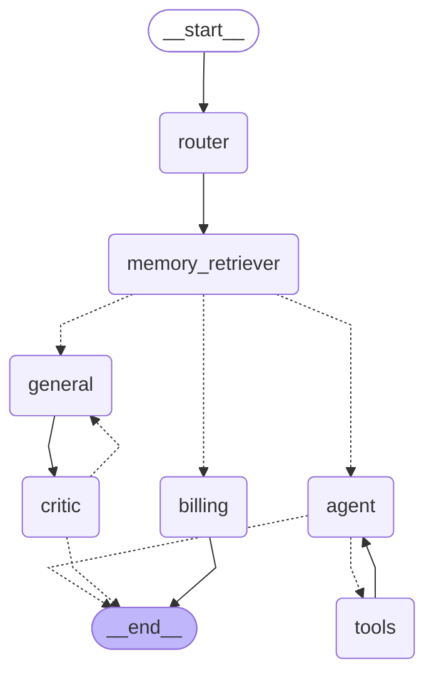

# How `app/graph/engine.py` Works

## State schemas

The graph has three `TypedDict` schemas:

- **`GraphInput`** — what a caller may pass in. Just `messages`.
- **`GraphState`** — the full shared scratchpad every node reads and writes.
- **`GraphOutput`** — what the compiled graph returns: `messages` and `status`.
  The scratchpad keys (`internal_logs`, `route_to`, `revision_count`,
  `critique`, `retrieved_context`) never leave the graph.

```python
class GraphState(TypedDict):
    messages: Annotated[list[BaseMessage], add_messages]
    status: str
    internal_logs: Annotated[list[str], merge_logs]
    route_to: Literal["technical", "billing", "general"]
    revision_count: int       # no reducer -> overwrite
    critique: str             # no reducer -> overwrite
    retrieved_context: list[str]  # no reducer -> overwrite
```

Reducers control how a node's returned value merges into state per key:

- `messages` uses `add_messages` — append, de-duplicating by message id.
- `internal_logs` uses `merge_logs` — a custom append-only reducer that tolerates
  a `None` left side and skips lines already present, so the `general <-> critic`
  cycle cannot duplicate audit entries.
- Keys with no `Annotated` reducer overwrite. `retrieved_context` follows this
  convention deliberately: each user turn's retrieval replaces the last rather
  than accumulating, so it survives untouched across `general_worker`'s repeat
  visits within one critic-loop revision.

## The graph

Regenerate this block from the compiled graph:

```bash
uv run python -c "from app.graph.engine import graph_mermaid; print(graph_mermaid())" > docs/graph.mmd
```



Solid arrows are unconditional edges; dotted arrows (`-.->`) are conditional
edges resolved at runtime by a router function. `docs/graph.mmd` carries the
same diagram in its own file; `tests/graph/test_visualization.py` asserts the
two stay identical.

## Nodes

| Node | Function | Role |
| --- | --- | --- |
| `router` | `route_request` | Classifies the last human message as `technical` / `billing` / `general`, writes `route_to`. |
| `memory_retriever` | `retrieve_semantic_memories` | Queries the cross-thread Qdrant store (Lab 38/39) for the current query, filtered to threads the caller owns (admins see everything). Writes `retrieved_context`. Sits ahead of every route, exactly once per user turn. |
| `agent` | `call_model` | Calls the LLM (Ollama/vLLM via `get_sovereign_llm()`, bound to `tools`), consulting `retrieved_context` if present. Loops with `tools` until the model stops requesting tool calls. |
| `tools` | `ToolNode(tools)` | Executes the tool calls the model asked for, returns results to `agent`. |
| `billing` | `billing_worker` | Answers a billing enquiry with one LLM call, consulting `retrieved_context` if present. Terminal - no loop. |
| `general` | `general_worker` | Drafts a general-enquiries answer with one LLM call, consulting `retrieved_context` and the critic's last note. Re-entered by the critic loop; increments `revision_count`. |
| `critic` | `critic` | Grades the latest `general` draft, writes `critique` (`"PASS"` or a note). |

## Edges

- `START -> router` — every request is classified first.
- `router -> memory_retriever` — unconditional. Every route (`technical`,
  `billing`, `general`) passes through retrieval first, exactly once per user
  turn; no route bypasses it.
- `memory_retriever` (conditional, `after_memory_retriever`) — reads `route_to`
  (written by `router`, untouched by `memory_retriever` itself) and resumes at
  `technical -> agent`, `billing -> billing`, `general -> general`. One
  retrieval node serving three destinations, not three copies.
- `agent` (conditional, `tools_condition`) — tool calls pending `-> tools`,
  otherwise `-> END`.
- `tools -> agent` — unconditional; the tool loop.
- `billing -> END`.
- `general -> critic` — unconditional; every draft is graded.
- `critic` (conditional, `after_critic`) — `critique == "PASS"` `-> END`,
  otherwise `-> general`. `GENERAL_REVISION_LIMIT` (3) forces `PASS` to break
  the cycle. This re-entry edge goes straight back to `general`, **not**
  through `memory_retriever` — a revision reuses the same `retrieved_context`
  already in state instead of re-querying Qdrant on every attempt.

There is no `pick_route` function - earlier revisions of this graph used a
conditional edge on `router` to send each `route_to` value directly to its
worker. Once `memory_retriever` needed to sit ahead of every route, that
conditional edge always picked the same single destination
(`memory_retriever`), so it collapsed to a plain `add_edge` and the real
three-way decision moved to `after_memory_retriever`, which reads the same
`route_to` value further downstream.

## Runtime context

Nodes that need dependencies not carried in `GraphState` receive them via
`Runtime[RuntimeContext]`, injected per call through `context=`:

```python
@dataclass
class RuntimeContext:
    llm: BaseChatModel
    db: AsyncSession | None = None
    username: str = ""
```

`llm` is required - every node that calls a model needs it. `db` and
`username` default because not every caller has a real user (a smoke test, a
demo script), but any caller whose request can reach `memory_retriever` for a
non-admin user must supply both, or `owned_thread_ids` fails against a `None`
session. `is_admin(username)` short-circuits `memory_retriever` past the `db`
lookup entirely, so a caller with no real user context can safely pass
`username="admin"` (or leave it, and hit `is_admin("")` -> `False` ->
`owned_thread_ids(None, ...)`, which crashes - only safe when nothing on that
path calls `memory_retriever`).

## Compiling

```python
graph_builder = StateGraph(
    GraphState,
    input_schema=GraphInput,
    output_schema=GraphOutput,
    context_schema=RuntimeContext,
)
# add_node / add_edge / add_conditional_edges ...
checkpointer = InMemorySaver()
workflow = graph_builder.compile(checkpointer=checkpointer)
```

`compile()` returns a `CompiledStateGraph` with `.ainvoke()` / `.astream()`.
The module-level `workflow` compiles with an `InMemorySaver` - volatile,
process-local - as a default so importing `app.graph.engine` never requires a
database. `app/main.py`'s lifespan swaps this for a persistent
`AsyncPostgresSaver` (`workflow.checkpointer = saver`) when the app actually
starts, so real runs get restart-durable thread memory (Lab 31/33); tests
that want the in-memory default just import `workflow` directly.

`input_schema` filters the inbound dict to `GraphInput` keys; `output_schema`
prunes the return value to `GraphOutput`. On langgraph 1.x, override the
pruning at call time with `output_keys=[...]`, not the `output_schema=` kwarg
(which does not exist on `ainvoke` / `astream`).

## Who calls it

| Caller | Method | Notes |
| --- | --- | --- |
| `app/main.py` — `/test/smoke` | `await workflow.ainvoke(state)` wrapped in `asyncio.wait_for` | open route, 60 s timeout; builds its own `context={"llm": ..., "username": settings.demo_username}` |
| `app/api/v1/endpoints.py` — `/api/v1/run` | `await workflow.ainvoke(state)` | authenticated, rate-limited; `context` carries `llm`, `db`, `username` |
| `app/api/v1/endpoints.py` — `/api/v1/run/stream` | `async for … in workflow.astream(state, stream_mode=["updates", "custom"])` | streams node deltas and `writer({"status": ...})` events as SSE; same three-key `context` |
| `app/api/v1/endpoints.py` — `/api/v1/ask` | `await workflow.ainvoke(state)` | authenticated, rate-limited, cached (`@cache`, 300s) with an explicit `key_builder` so the per-request `db` session's identity doesn't defeat the cache key |
| `app/api/v1/endpoints.py` — `/admin/threads/{id}/resume` | `await workflow.ainvoke(None, config=checkpoint_config(...))` | resumes a checkpointed run in place, no new message appended |
| `app/api/v1/endpoints.py` — `/admin/threads/{id}/fork` | `await workflow.ainvoke(state, config=checkpoint_config(...))` | branches from a past checkpoint with a new message |

All callers build the initial state as `{"messages": [HumanMessage(...)]}` (or
`{"messages": [("user", ...)]}` in the smoke test) and read the result as
`result["messages"][-1].content`. Every one of them must supply
`context={"llm": ..., "db": ..., "username": ...}` (or at minimum `llm` plus
`username="admin"`-style admin short-circuit) now that `memory_retriever`
sits ahead of every route - a `context` missing `db`/`username` only worked
before this graph had a retrieval node on every path.

## Standalone script

The `if __name__ == "__main__":` block runs the three canonical prompts
(technical / billing / general) directly, outside any FastAPI route:

```bash
uv run python -m app.graph.engine
```

It streams `stream_mode="values"` with `output_keys=list(GraphState.__annotations__)`
so the full scratchpad is visible while developing, and pretty-prints the last
message at each step. It passes `context={"llm": demo_llm, "username": "admin"}`
so its own run reaches `memory_retriever` on the admin short-circuit rather
than needing a real `db` session.
