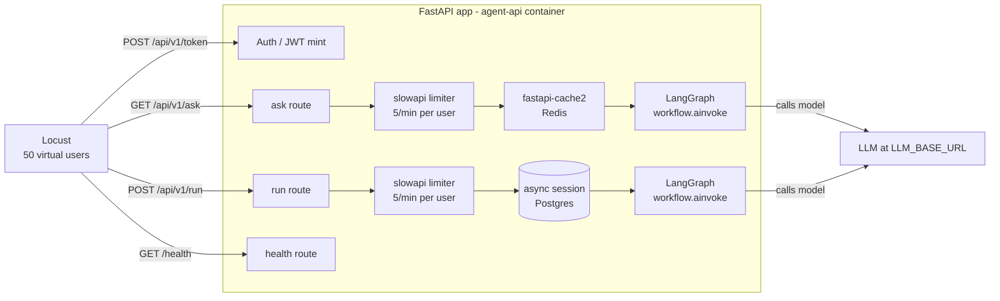
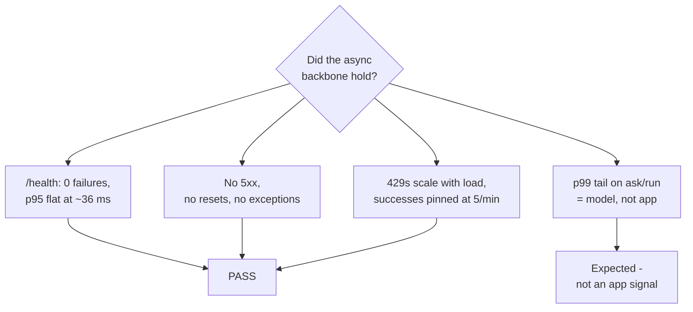

# Module 2 Load Test - Stress-Testing the Async Backbone

A record of the load test run against the async backbone: what was run, what the
numbers were, and how to read them. This file is the result and the reference.

## What was tested

The request path was built one layer at a time - dependency injection, global
exception handlers, request-id middleware, SSE streaming, OAuth2/JWT, per-user
rate limiting, a Redis response cache - and each layer was checked in isolation.
This test drives all of them at once under concurrency and asks a single
question: **does the app's own overhead stay flat as load climbs, or does
something in the async path start to choke?**



`/health` touches none of the middleware stack - no auth, no limiter, no cache,
no DB, no model. It is the clean measurement of the app shell. The other three
routes are there to generate realistic contention around it.

## Test parameters

| Setting       | Value                                                                      |
| ------------- | -------------------------------------------------------------------------- |
| Tool          | Locust (`uv add --dev locust`), `locustfile.py` at repo root               |
| Target        | `http://localhost:8000` (host-published `agent-api`)                       |
| Virtual users | 50                                                                         |
| Spawn rate    | ~10/s (all 50 active within ~10 s)                                         |
| Duration      | 3 min 51 s                                                                 |
| Task mix      | `ask` :3, `health` :2, `run_agent` :1                                      |
| Auth          | every user logs in as the same `admin` (`DEMO_PASSWORD`)                   |
| Graph         | real - `workflow` compiled against the live LLM at `LLM_BASE_URL`, no stub |

All 50 users sharing one `admin` identity is deliberate: it puts every
rate-limited request into **one** `5/minute` bucket, so the limiter is under
maximum pressure.

## Headline results

| Endpoint             | Requests | Failures | Fail % |    p50 |    p95 |    p99 |    max |  RPS |
| -------------------- | -------: | -------: | -----: | -----: | -----: | -----: | -----: | ---: |
| `GET /health`        |    1,938 |        0 |   0.0% |   4 ms |  36 ms | 550 ms |  1.5 s |  8.4 |
| `POST /api/v1/token` |      ~50 |        0 |   0.0% | 150 ms | 370 ms | 370 ms | 370 ms |    - |
| `GET /api/v1/ask`    |    2,872 |    2,852 |  99.3% |   5 ms |  42 ms |  1.1 s |  129 s | 12.4 |
| `POST /api/v1/run`   |      955 |      942 |  98.6% |   6 ms | 110 ms |  111 s |  162 s |  4.1 |
| **Aggregated**       |    5,815 |    3,794 |  65.2% |   5 ms |  60 ms |  1.1 s |  162 s | 25.1 |

**Every one of the 3,794 failures is HTTP `429 Too Many Requests`.** No `5xx`,
no connection resets, no dropped requests, no Python exceptions.

```
Failure breakdown (3,794 total)
  GET  /api/v1/ask   429 x 2852  ################################  75.2%
  POST /api/v1/run   429 x  942  ##########                       24.8%
  5xx / timeouts / resets    0                                     0.0%
```

## The two numbers that look wrong (and aren't)

### 1. ~99% failure rate on `/ask` and `/run`

That is the rate limiter doing its job. 50 users, one shared `admin` bucket,
`5/minute` per route:

```
Expected successes per route  =  5 req/min  x  3.85 min  =  ~19
Actual   /ask successes       =  2872 - 2852  =  20
Actual   /run successes       =   955 -  942  =  13
```

The math lines up. Everything past the 5th request per minute got a clean
`429`, exactly as the per-user limiter is designed to behave. A load test that
drove this to 0% failures would mean the limiter had stopped working.

### 2. Multi-minute p99 / max on `/ask` and `/run`

The ~20 requests per route that got _past_ the limiter went to the real
LangGraph workflow, which called the model at `LLM_BASE_URL`. Those waits are
the LLM, not the app:

```
Response-time percentiles (ms)

/health     p50    4  |=
            p90   12  |==
            p95   36  |=====
            p99  550  |========================================
            max 1500

/api/v1/ask p50    5  |
            p90   15  |
            p95   42  |=
            p99 1100  |==
            max 129000  <-- one request waited 129 s on the model

/api/v1/run p50    6  |
            p90   24  |
            p95  110  |
            p99 111000  <-- p99 IS the model; only ~13 reqs got through
            max 162000
```

`/run` p99 being 111 s is an artifact of the tiny successful-request count -
with only ~13 samples, the 99th percentile _is_ essentially the slowest one.
It says nothing about the app.

## The number that matters: `/health` over time

`/health` is the app shell with nothing in front of it. If the event loop were
being starved - a blocking call somewhere in middleware, a saturated thread
pool - its latency would climb as the 50 users piled on. It did not.

```
/health p95 (ms) across the run - 10s buckets, users pinned at 50 after 0:10

 ms
1400 |  *
     |  *
 660 |* *
     |* *
 150 |* *  *              *
  85 |* *  *  *    *      *
  40 |* *  *  * *  * ** * * *  *  * ** *  *  * *
  10 |*_*__*__*_*__*_*__*_*__*_*__*_*__*__*__*__*__*__*
     +--------------------------------------------------
     0:00   0:30   1:00   1:30   2:00   2:30   3:00  3:51
            |
            first ~20s: cold start (pool warm-up, first cache/JIT paths)
            then: flat, mostly single-digit-to-40ms p95 for 3+ minutes
```

Throughput and failure rate were also stable for the whole run - no decay, no
runaway:

```
Aggregate RPS and fail/s - 10s buckets

 30 |        .-------------------------------------.   total RPS
 25 |    .--'                                       `  ~25 steady
 20 |   /
 15 |  /   .-----------------------------------------   fail/s (429)
 10 | /  .'                                            ~16-18 steady
  5 |/ .'
  0 +--------------------------------------------------
    0:00   0:30   1:00   1:30   2:00   2:30   3:00  3:51
```

## Verdict



**Pass.** Under 50 concurrent users for ~4 minutes the app shell stayed flat
and error-free, the rate limiter absorbed the excess cleanly, and nothing in
the async path (event loop, Postgres pool, Redis connection) broke or degraded.

## Limitations of this run

- **One user identity.** All load hit one rate-limit bucket. A run with
  per-user tokens would exercise the limiter's per-key bookkeeping and the
  cache's per-user isolation - neither was tested here.
- **Real model in the path.** `/ask` and `/run` latency is dominated by the
  LLM, so this run says little about those routes' own overhead. To measure
  that, point `LLM_BASE_URL` at a fast echo model for the duration of the test.
- **50 users is modest.** The `/health` p95 stayed flat here; the next question
  is where it _stops_ being flat. A ramp to 200, 500, 1000 users would find the
  actual knee.
- **Single machine, single API replica.** No horizontal scaling, no real
  network. This measures the app, not a deployment.

## Reproducing

```bash
# 1. stack up (Mac overlay)
podman compose -f compose.yaml -f compose.mac.yaml up -d --build

# 2. demo password set in .env.mac, container recreated
grep -c '^DEMO_PASSWORD=' .env.mac          # must print 1
podman compose -f compose.yaml -f compose.mac.yaml up -d agent-api

# 3. headless run, same parameters as above
uv run locust -f locustfile.py --host http://localhost:8000 \
  --headless -u 50 -r 10 -t 4m --html locust-report.html

# 4. tear down
podman compose -f compose.yaml -f compose.mac.yaml down
```

Drop `--headless` and the `-u/-r/-t` flags to drive it from the web UI at
<http://localhost:8089> instead. `locustfile.py` at the repo root defines the
task mix.
